# The Agentic Squad Workflow

> **Canonical, invocable procedure.** When Tarig says *"run the agentic workflow for X"* (or *"use the squad"*, *"agentic workflow"*), execute exactly this — no re-explanation needed. This doc + the role identities in [`roles/`](roles/) are the single source of truth for the roles, their scope, the severity gate, and how a bottleneck becomes a shipped release.
>
> **Model- & runner-agnostic by design.** The roles are portable **identities** ([`roles/`](roles/)), written for *any capable LLM on any runner* — not tied to a vendor. The procedure below is runner-neutral; the platform-specific machinery is isolated in **[Current-runner bindings](#current-runner-bindings-claude-code)**. Same bet the project made for the LLM itself ([ADR-0012](../docs/adr/0012-model-agnostic-llm.md)/[ADR-0017](../docs/adr/0017-llm-transport-openai-compatible-deepseek.md)), applied one level up — see [`.agents/README.md`](README.md).
>
> **What / Why / So-what.** *What:* a per-bottleneck squad of role-agents (driven by an orchestrator) that turns one real problem into one reviewed, verified, shipped release. *Why:* depth over breadth — the project is ~70%+ built and needs surgery, not foundations; the human's review bandwidth + token efficiency are the binding constraints, not build throughput. *So-what:* the orchestrator runs it mostly autonomously, pausing only where a human decision is genuinely required.

---

## When + how to invoke

| Trigger (Tarig's words) | What the orchestrator does |
|---|---|
| *"run the agentic workflow / squad for `<problem>`"* | Run the full pipeline below on that one problem. |
| *"run a bottleneck scan"* / *"what's next?"* | Just the **Investigator** (P2 ranking) — surface + rank the top-3 bottlenecks, recommend one. No build. |
| *"don't permit me every time"* / opt-in already given | Run **non-crucial** units end-to-end autonomously (build → review → merge), reporting after — pausing only at the checkpoints below. |

**One bottleneck at a time. One squad run = one branch = one PR. Never more than one open PR.** (Throughput overlap allowed: the *next* run's read-only Investigator may start while a PR is in review.)

---

## The roles

Three fresh subagents + an orchestrator/scribe. Each subagent is a **fresh context** (no memory of how prior stages ran) — that independence is the point. Each role's full portable identity — goal, scope, inputs, outputs, boundaries, done-criteria — lives in [`roles/`](roles/):

| Role | One-line | Identity spec |
|---|---|---|
| **Investigator** | fresh, **read-only** — verify the problem on real code/data, measure it, draft the minimal-fix brief, classify severity; **can KILL the unit** | [`roles/investigator.md`](roles/investigator.md) |
| **Surgeon** | fresh — build the **smallest diff** from the *approved* brief, in an isolated worktree; write tests | [`roles/surgeon.md`](roles/surgeon.md) |
| **Examiner** | fresh, adversarial — **one agent, two passes** (break-it, then integration/simplify); runs the gate; ranks findings | [`roles/examiner.md`](roles/examiner.md) |
| **Orchestrator / Scribe** | drives the pipeline, adjudicates, classifies severity, merges, records; the human interface (Claude, in the current runner) | [`roles/orchestrator-scribe.md`](roles/orchestrator-scribe.md) |

The roster is **extensible** — add or drop roles per the procedure when a workflow genuinely needs it.

> **Do NOT split the Examiner into two agents.** One Examiner, two passes (a deliberate decision, 2026-07-07). It *is* the fresh-context adversarial verifier that [ADR-0019](../docs/adr/0019-agentic-build-orchestration.md)'s amendment mandates — an orchestrator-framed reviewer inherits the orchestrator's blind spots; a fresh, adversarially-prompted Examiner does not.

**Plus genuinely external eyes on every PR:** an automated reviewer (**CodeRabbit**, in the current runner) + the **human**. They complement — never replace — the Examiner.

---

## The pipeline

```mermaid
flowchart LR
  P2["P2: pick the bottleneck<br/>(top-3 → leverage rank)"] --> INV["INVESTIGATOR<br/>fresh · read-only<br/>verify · measure · brief · severity"]
  INV -->|"KILL if not real"| X["stop"]
  INV --> A{"severity?"}
  A -->|CRUCIAL| HB["human: approve brief"]
  A -->|non-crucial| SUR
  HB --> SUR["SURGEON<br/>smallest diff · worktree · tests"]
  SUR --> EXAM["EXAMINER<br/>fresh · adversarial pass + simplify pass"]
  EXAM -->|findings| ADJ["orchestrator adjudicates<br/>fix every real finding · re-verify"]
  ADJ --> PR["branch → PR → CI + CodeRabbit"]
  PR --> M{"merge?"}
  M -->|"non-crucial + CLEAN + green CI<br/>+ within blast radius"| AM["auto-merge · report after"]
  M -->|CRUCIAL| HP["human: approve PR → merge"]
  AM --> SCR["SCRIBE close-out<br/>CHANGELOG · ledgers · ADR"]
  HP --> SCR
  SCR --> DEP["human: live deploy + smoke<br/>(always a checkpoint)"]
  DEP --> SHIP["tag + release → P2 reopens"]
```

**Stage detail**
1. **Pick the bottleneck (P2).** Per the [migration-decision protocol](../docs/03-roadmap.md#the-migration-decision-protocol-how-the-next-step-is-actually-chosen): surface the top-3 bottlenecks blocking the next *real* capability, rank by **leverage = capability ÷ complexity**, pick the highest. Observed-from-use candidates live in [`docs/ledgers/backlog.md`](../docs/ledgers/backlog.md).
2. **Investigator** verifies it on live code/data (read-only), drafts the minimal-fix brief (problem+evidence · blast radius · minimal change · files · validation gate [behavioral + a negative case] · out-of-scope), and classifies severity. **It can kill the unit.**
3. **Surgeon** builds the smallest diff from the *approved* brief in an isolated worktree; writes tests; does not push/merge/deploy.
4. **Examiner** (fresh) runs its two passes; the orchestrator **fixes every real finding** and re-verifies (a second fresh re-verify if the fixes were non-trivial).
5. **PR → CI + external reviewer → merge** per the severity gate.
6. **Scribe close-out** (orchestrator): CHANGELOG `[Unreleased]` entry, ledger rows ([interface-contracts](../docs/ledgers/interface-contracts.md) Produces · [phase-index](../docs/ledgers/phase-index.md) · [backlog](../docs/ledgers/backlog.md)), and an [ADR](../docs/adr/) if it's a real decision.
7. **Deploy + tag** (see the deploy checkpoint below), then **P2 reopens**.

---

## The severity gate (the auto-pilot policy)

The orchestrator classifies severity **at brief time** (never at PR time). Doubt **rounds up**.

- **CRUCIAL** — touches ANY of: a **schema / data-shape migration**, **scoring semantics**, **live infra / state / DNS**, a **new external dependency**, or **PII**. → **Both human checkpoints:** the brief before code, and the PR before merge.
- **Non-crucial** — everything else. → **Auto-merge** when **all** hold: Examiner **CLEAN PASS** (zero contested findings) · CI **fully green** · the diff is **within the brief's declared blast radius**. Report the merge *after*.
- **Always escalates, regardless of tier:** any **contested Examiner finding**, any **scope creep** beyond the brief's blast radius, or genuine doubt.
- **The live deploy is always a human checkpoint** — deploying to the running stack touches live infra and spends a real run. Build + merge autonomously; bring the human the *deploy + smoke*.

---

## Current-runner bindings (Claude Code)

> The identities + pipeline above are **runner-neutral**. The machinery below is how they're currently *bound* to this runner (Claude Code + this repo's conventions). A different runner would remap these — see [Porting](#porting-to-another-runner-deferred).

- **Isolation:** the Surgeon works in a **git worktree** (units that mutate files stay off `main`'s tree until reviewed). Disjoint-file parallel work needs no worktree.
- **Branch / PR / protected `main`:** one branch → one PR → required checks (`lint-and-test` · `terraform-validate` · `secret-scan`) + CodeRabbit → merge (squash) → delete the branch → prune the worktree ([ADR-0013](../docs/adr/0013-enforcement-gate-trio-branch-pr.md)).
- **Gate-trio alignment:** the pipeline maps onto the [gate-trio commands](../.claude/commands/) — `/start-step` (brief/entry) · `/review-step` (Examiner) · `/close-step` (scribe).
- **Deploy sequence** (when the unit needs it): `build_lambda` → `terraform apply` → `{"mode":"smoke"}` → **200** → a live-validate invoke → **tag the release**. Honor the three migrate-order classes in the [procedure registry](../docs/ledgers/procedure-registry.md).

### Porting to another runner (deferred)

Everything above is runner-neutral by design; only the *enforcement* of each identity (tool-scoping, one-writer isolation, the PR/CI/review machinery) is Claude-Code-specific — currently done by **prompting + these conventions**, not by hard wiring. When there's a real second runner, add a thin **adapter** that binds the [`roles/`](roles/) identities to that platform's native format — e.g. generate `.claude/agents/*.md` (to make the Investigator *physically* read-only in Claude Code), an OpenAI Agents SDK / Gemini equivalent, and optionally align the entry file with the emerging cross-tool [`AGENTS.md`](https://agents.md) convention. **Deferred on purpose (P1):** no multi-runner infra before a second runner is real. Tracked in [`.agents/README.md`](README.md).

---

## Provenance + reconciliation

- **Foundational decision:** [ADR-0019 — Agentic build orchestration](../docs/adr/0019-agentic-build-orchestration.md). This doc is its **current operational form.** ADR-0019's generic `Builder → Reviewer → Scribe → Guardian` roster was refined (2026-07-07) into the **per-bottleneck squad** here (`Investigator → Surgeon → single Examiner` + severity-gated auto-merge). The Examiner embodies ADR-0019's amended **fresh-context Independent Verifier** lesson.
- **Sits alongside:** the [P2 bottleneck protocol](../docs/03-roadmap.md) (what to build next) and the [gate-trio commands](../.claude/commands/) (the entry/code/exit gates).
- **History:** first used to build **v0.7.0** (2026-07-08, the first auto-pilot unit); proven fully autonomous on **B-1 → v0.10.0** (2026-07-10 — see the worked example).

---

## Worked example — B-1 (shipped as v0.10.0, 2026-07-10)

The reference execution, end to end, mostly autonomous (the orchestrator here was Claude):

1. **Investigator** (read-only) verified B-1 on the live stack — 286 scored jobs, 225 below threshold, ~281 unreachable from the digest; ranked it the top squad-actionable bottleneck (B-2 outranked on impact but blocked on a human prerequisite → escalated); drafted the minimal-fix brief; classified it **NON-CRUCIAL** (no migration/scoring/infra/dep/PII).
2. **Surgeon** built the smallest diff in a worktree (new `core/report.py` + `adapters/s3_reports.py` + `Repository.get_all_scored` + a non-fatal `notify` guard) — 385 unit tests, ruff clean.
3. **Examiner** (fresh, two passes) → **CLEAN PASS, zero blocking** (verified the non-fatal guard's blast radius, the Data-API SQL, and URL safety with hostile inputs).
4. **CI + CodeRabbit** green → the orchestrator **auto-merged** PR #30 (non-crucial policy), cleaned the worktree, and did the **scribe close-out** (CHANGELOG + backlog).
5. **Deploy checkpoint** (human "go") → terraform apply (1 change) → smoke `200` → live-validated `get_all_scored` over the Data API (286 rows, 242 KB report page) → tagged **v0.10.0** + release → **P2 reopened**.

The only human touchpoints were the deploy "go" and (separately) the B-2 domain decision the Investigator escalated. Everything else ran on auto-pilot.
