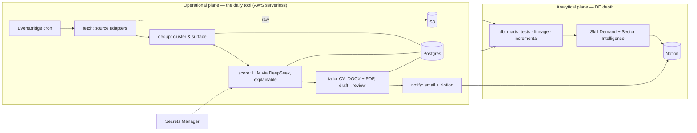

# JobFetcher

**A serverless job-matching pipeline that scores roles against your real profile and tailors a CV for the good ones — built as an *evolutionary architecture* you can watch grow, one deliberate migration at a time.**

> **Status:** 🏗️ Built in the open. Currently building **v0** — the ingestion probe (Step 0) is validated against the live API. This is an evolutionary project — it starts intentionally small and grows through a sequence of clean, documented releases. See the [roadmap](docs/03-roadmap.md) and live [phase index](docs/ledgers/phase-index.md).

---

## The problem

A serious job search drowns you in noise: dozens of postings a day, most of them a poor fit you can't tell apart from the good ones until you've spent 45 minutes tailoring a CV. JobFetcher turns that into a daily, scored shortlist — *"here are the roles actually worth your time, with the reasons, and a tailored CV ready"* — so the per-job cycle drops from 45 minutes to 5.

It does **not** auto-apply (external ATS automation is brittle and risky). It removes the *discovery, filtering, and preparation* toil and leaves the human decision where it belongs.

## What makes this repo worth reading

This is a personal-scale tool built to **production standards** — and, deliberately, an exercise in **evolutionary architecture**:

- It ships as a **minimal core first**, then grows only by **solving the next real bottleneck** — every added piece of complexity is justified by a capability it unlocks, recorded in an ADR.
- Each migration is a **clean, observable GitHub release** with a before/after diagram and a migration guide. You can read the architecture *evolve*.
- The design is **honest about scale**: at ~10–30 jobs/day nothing here is justified by load — so every choice is defended on *fit and judgment*, not buzzwords. Where something exists to demonstrate a skill, it's labeled as such.

## Architecture (target shape — reached via migrations, not built at once)

- **Operational plane:** scheduled run → fetch (pluggable source adapters) → dedup (groups suspected duplicates and surfaces them — never silently hides a real job) → LLM scoring (DeepSeek) with explanations → CV tailoring (reliable renderer, human-review gate) → email + Notion. State in **Postgres**, raw objects + CVs in **S3**, credentials in **Secrets Manager**, region **us-east-1**.
- **Analytical plane (DE depth):** **dbt** models the medallion into marts (with tests, lineage, incremental) — on **Postgres** by default; a dedicated **Snowflake** warehouse is added *only if* a real analytics bottleneck ever justifies it. Powers a live Skill-Demand tracker and weekly Sector Intelligence.

> **v0 is much smaller than the diagram:** one scheduled Lambda → one source → score → daily email. The diagram is the *destination*; the [roadmap](docs/03-roadmap.md) is the path.

## Tech stack

Python · AWS (Lambda, EventBridge, S3, Secrets Manager; Step Functions + more added by migration) · **PostgreSQL** · **dbt** · **LLM via OpenAI-compatible API** (model-agnostic; v0 = DeepSeek) · **Terraform** · GitHub Actions · Notion API · SES. Snowflake / Debezium-CDC / Spark are *documented scale-paths or live in sibling projects* — see the [decision journal](docs/01-session-decision-journal.md).

## Documentation

This project treats **documentation as infrastructure** — the repo is the memory, and any contributor (human or agent) resumes from the files alone.

- 🧭 [`CLAUDE.md`](CLAUDE.md) — operating rules + navigation
- 🧩 [`docs/00-design-philosophy.md`](docs/00-design-philosophy.md) — the principles every decision obeys
- 📓 [`docs/01-session-decision-journal.md`](docs/01-session-decision-journal.md) — *why* the design is what it is
- 🏛️ [`docs/02-architecture.md`](docs/02-architecture.md) — the full design
- 📊 [`docs/diagrams.md`](docs/diagrams.md) — all the Mermaid diagrams: architecture · roadmap · dimensional model
- 🗺️ [`docs/03-roadmap.md`](docs/03-roadmap.md) — directional roadmap + how the next migration is chosen
- 🔨 [`docs/04-v0-build-plan.md`](docs/04-v0-build-plan.md) — the v0 build, step by step
- 🧱 [`docs/adr/`](docs/adr/) — architecture decision records (with the roads not taken)

## Setup, run & teardown

Setup and deployment instructions land **with v0** (they describe real, runnable infrastructure — they will not be written before that infrastructure exists). The project is designed for **`terraform destroy` → $0** when idle. Real personal data (CV/profile) never enters this repo; a sanitized sample is provided so the system is demonstrable by anyone.

---

*Built by Tarig Elamin. Personal-scale tool, production-grade engineering, evolved deliberately.*
