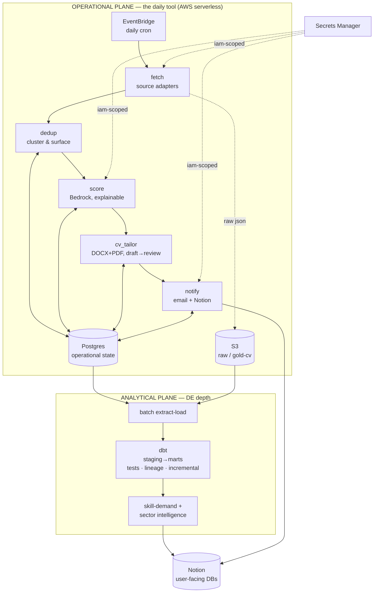
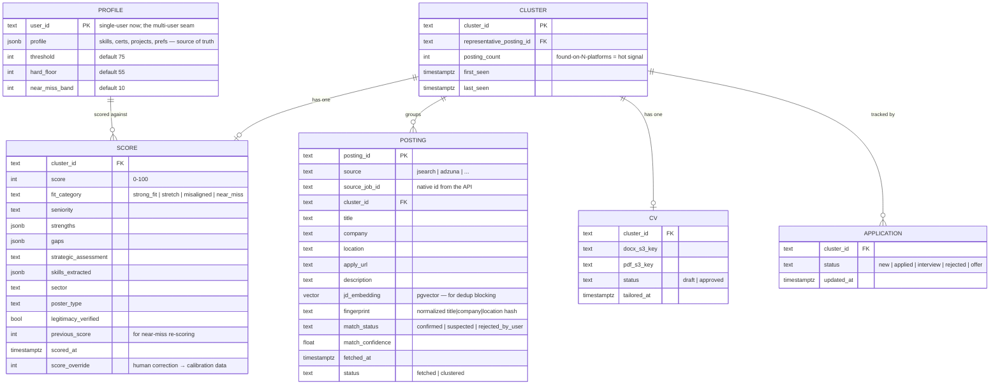

# 02 · Architecture

> This describes the **target shape** — the destination reached through migrations. **v0 is a deliberate subset** (see the "v0 subset" callout at the end and [04-v0-build-plan](04-v0-build-plan.md)). Every component here has passed the [defensibility rubric](00-design-philosophy.md#the-defensibility-rubric); showcases are labeled.

## Two planes

The system is split into two cleanly-separated planes. This separation is the core design idea: it lets the **analytical (DE-depth)** work evolve independently of the **operational (daily tool)** work, and it keeps each plane's complexity honest.



- **Operational plane** = the job-hunting tool. Stateless compute over **Postgres** (operational state) + **S3** (raw payloads + generated CVs). This is what runs daily and what Tarig uses.
- **Analytical plane** = the DE-depth layer. **dbt** models the data into marts (with tests/lineage/incremental), which feed the Skill-Demand tracker and Sector Intelligence. Runs on **Postgres by default**; a dedicated **Snowflake** warehouse is *conditional* (added only if a real analytics bottleneck demands it — [ADR-0004](adr/0004-warehouse-strategy.md)).

**Cross-cutting:** **Secrets Manager** (IAM-scoped per function) · **correlation IDs** on every pipeline run (one `run_id` threaded through logs + rows + S3 objects) · region **us-east-1** ([ADR-0008](adr/0008-region-us-east-1.md)) · **right-sized observability** (a few real alarms — pipeline-didn't-run, cost-spike, error-rate — + documented SLOs; not a full dashboard suite).

---

## Operational plane — components & contracts

Each component is a single responsibility with an explicit **Consumes → Produces** contract (tracked in [ledgers/interface-contracts](ledgers/interface-contracts.md)). They communicate through Postgres state + S3, not by calling each other directly.

| Component | Consumes | Produces | Notes |
|---|---|---|---|
| **fetch** | `search_config`, source secrets | raw postings (S3 `raw/`), upserted `posting` rows (status `fetched`) | Pluggable **source adapters** (JSearch, Adzuna, …) normalize each API into one internal schema *before* anything downstream — the **data contract** boundary. |
| **dedup** | new `posting` rows | `cluster` rows + `posting.cluster_id` + `match_status`/`match_confidence` | **Cluster-and-surface** (never hide). Detail below. Scoring/CV run **once per cluster**. |
| **score** | cluster representative + candidate profile | `score` row (score, fit, strengths, gaps, strategic_assessment, skills_extracted, sector), status `scored` | Bedrock, 7-factor ATS, explainable, temp 0. Detail below. |
| **cv_tailor** | scored cluster (≥ threshold) + master CV | DOCX+PDF in S3 `gold/cvs/...`, `cv` row (status `draft`) | Reliable renderer (no LibreOffice). Draft → human-review gate → `approved`. |
| **notify** | newly-scored clusters, graduations | daily email (SES) + Notion rows | Email = morning triage; Notion = act + track. |

**Orchestration:** in v0 this is **one Lambda** doing all steps in sequence. It migrates to **Step Functions** (M3) only when the single Lambda is genuinely too big — *earned*, not assumed.

---

## Data model (Postgres) — the operational store

Relational data → relational store ([ADR-0003](adr/0003-postgres-over-dynamodb.md)). The dedup model is the interesting part: **postings** are raw per-platform listings; a **cluster** groups postings believed to be the same real job; scoring and CVs attach to the **cluster**, not the posting — so we do the expensive work once but keep every platform's apply-link.



- **`user_id` on PROFILE is the multi-user seam** — present from day one, single-valued now; multi-user is a future migration that adds the dimension across tables, not a rewrite.
- **Schema migrations** are first-class: **Alembic** versioned migrations; every release that changes the schema ships its migration. No ad-hoc `ALTER`.

### S3 layout
```
s3://jobfetcher-<env>/raw/{source}/{date}/{source_job_id}.json   # raw API payloads (lake landing)
s3://jobfetcher-<env>/gold/cvs/{cluster_id}/tailored_cv.docx     # editable draft
s3://jobfetcher-<env>/gold/cvs/{cluster_id}/tailored_cv.pdf      # submission-ready
s3://jobfetcher-<env>/analytics/...                              # dbt/export artifacts (later migration)
```
Config (`search_config`, sanitized sample profile) ships in-repo; **real profile/CV** is gitignored, uploaded to a private S3 prefix at setup.

---

## Deduplication — cluster-and-surface ([ADR-0005](adr/0005-dedup-cluster-and-surface.md))

**Principle:** never-miss > never-duplicate. A missed duplicate costs one extra cheap score; a *wrong merge* hides a real job — unacceptable. So the engine is **precision-first, fail-safe, and measured**, and it **never silently removes a posting**.

**Behavior:** group suspected-same postings into a **cluster**; surface the whole group with every platform's apply-link + a "suspected same as X/Y/Z" note; the user decides whether to apply via one or several. Uncertain clusters go to a dedicated **Suspected-Duplicates** Notion DB to confirm/split (machine proposes, user disposes).

**Signals (cheap → strong):**
1. **Exact source-id** (re-fetch of the same listing) — free.
2. **Deterministic fingerprint** — normalized `title|company|location` hash (lowercase, expand `Sr→Senior`, strip legal suffixes / remote-hybrid noise).
3. **Multi-signal resolution** for the ambiguous remainder: **JD-body embeddings** in **pgvector** (nearest-neighbor *blocking* — the biggest accuracy lever, since reposts share descriptions and different roles don't) + **apply-URL / canonical-id** match + **company-canonicalization** dictionary + **time-window** scoping (a repost months later is a genuine new opening, not a merge).

**Decision bands:** high-confidence-same → auto-cluster · high-confidence-different → keep separate · **ambiguous → LLM adjudication** on the full JD → SAME / DIFFERENT / **UNSURE** · **UNSURE → never auto-merge**; surface for one-click human merge.

**Measured, not promised:** every decision is logged; human confirmations of ambiguous clusters become labels → compute and track **precision/recall**. The auto-merge bar is kept conservative (precision-first). *This is a labeled showcase: entity resolution with real precision/recall numbers.* No literal "99.99%" claim — that's not honest for fuzzy matching.

---

## Scoring — explainable, calibrated

- **7-factor ATS framework** (core-skill match, tool/tech alignment, achievement relevance, seniority/scope, ATS-keyword, formatting/clarity, realistic fit). Weights tunable; refined during the scoring migration.
- **Explainability is the value:** structured output includes `strengths`, `gaps`, `strategic_assessment`, `skills_extracted`, `sector`, `poster_type`, `legitimacy_verified` — not just a number. Bedrock, **temperature 0** for stability.
- **Thresholds (config-editable):** **threshold 75** (active-but-selective), **hard floor 55**, **near-miss band 10** (→ near-miss = 65–74). Below floor → analytics only.
- **Calibration loop (lightweight):** the human-review gate captures `score_override` corrections as structured data → used to tune the scoring prompt and to drive a **"scoring accuracy" SLO** (% of scores that needed override). High reliability ROI, low complexity. *A labeled reliability showcase.*
- **Legitimacy gate** (scam detection, hard) + **poster-type label** (informational — direct employer / staffing / consulting / etc.; user decides). No hard-filter by company type.

---

## CV tailoring — reliable & honest ([ADR-0006](adr/0006-cv-renderer.md))

- **Renderer (reliability-first):** one structured content model → **DOCX via python-docx** + **PDF via a pure-Python/HTML path** (e.g. WeasyPrint). **No LibreOffice-in-Lambda** — it was the old design's #1 failure point.
- **Determinism:** Bedrock decides *what to say*; the renderer decides *how it looks* — so layout is 100% deterministic and only content changes per job.
- **Template:** the *tarig-cv* spec (fonts/colors/section order) as the refined base. **One master CV**; tailoring reorders/emphasizes per JD.
- **Honesty + review gate:** strict no-fabrication rules; every CV is a **draft** Tarig approves before it's "submission-ready." The review gate doubles as scoring-calibration capture.
- **Per-cluster:** one CV per cluster (identical content across platforms), every apply-link attached.

---

## Analytical plane — dbt marts ([ADR-0004](adr/0004-warehouse-strategy.md))

- **dbt on Postgres by default** — `staging → intermediate → marts`, with `not_null/unique/relationships/accepted_values` tests, lineage/docs, and incremental models. The medallion realized as *modeled SQL*, not just S3 folders. *This is the DE-depth headliner — labeled showcase.*
- **Marts (illustrative):** `dim_company`, `dim_skill`, `dim_job`, `fct_job_score`, `fct_skill_demand`, `fct_sector_signal`, `fct_application_funnel`.
- **Consumers:** Skill-Demand tracker (Roles-Blocked, You-Have-It, ROI priority) + weekly **Sector Intelligence** (Bedrock summaries *grounded in mart data*) → written back to Notion (a small, named **reverse-ETL** step + a light metrics layer — *not* a heavy semantic-layer framework).
- **Snowflake is conditional** — the documented scale-path if Postgres analytics ever becomes a real bottleneck. **Debezium CDC** is the documented scale-path for batch→streaming. Both deferred; both have a home in the roadmap.

---

## ⚠️ v0 subset — what's actually in the first release

v0 is **one scheduled Lambda → one source → score → daily email**, on **Postgres + S3**, with Secrets Manager, tests, and minimal CI. **Not in v0:** CV tailoring (M1), multi-source + clustering dedup (M2), Step Functions (M3), Notion + near-miss (M4), dbt marts (M5), analytics (M6), full observability (M7), CI/CD polish (M8). The data model above is created incrementally — v0 needs only `posting`, a trivial `cluster` (1:1), `score`, and `profile`. See [04-v0-build-plan](04-v0-build-plan.md) for the exact v0 scope and [03-roadmap](03-roadmap.md) for how the rest arrives.
