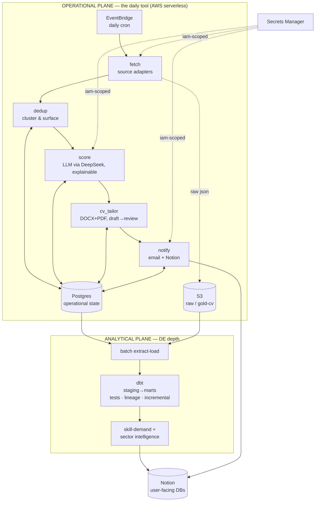
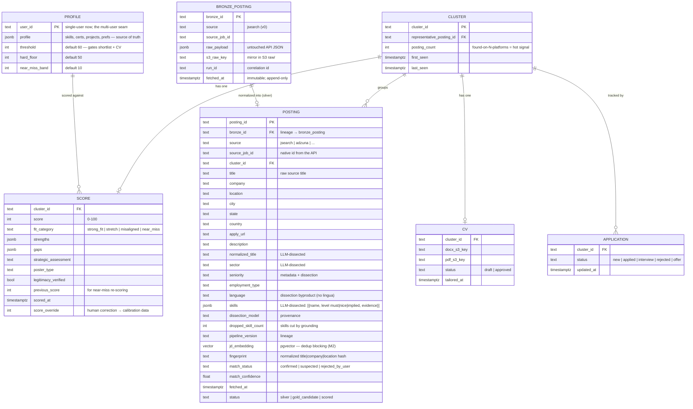

# 02 · Architecture

> This describes the **target shape** — the destination reached through migrations. **v0 is a deliberate subset** (see the "v0 subset" callout at the end and [04-v0-build-plan](04-v0-build-plan.md)). Every component here has passed the [defensibility rubric](00-design-philosophy.md#the-defensibility-rubric); showcases are labeled. 📊 All diagrams are collected in [diagrams.md](diagrams.md).

## Two planes

The system is split into two cleanly-separated planes. This separation is the core design idea: it lets the **analytical (DE-depth)** work evolve independently of the **operational (daily tool)** work, and it keeps each plane's complexity honest.



- **Operational plane** = the job-hunting tool. Stateless **Lambda** compute (outside any VPC) over **Postgres** (**Aurora Serverless v2 + RDS Data API** — HTTPS DB access, no VPC/NAT; [ADR-0014](adr/0014-operational-store-aurora-serverless-data-api.md)) + **S3** (raw payloads + generated CVs). This is what runs daily and what Tarig uses.
- **Analytical plane** = the DE-depth layer. **dbt** models the data into marts (with tests/lineage/incremental), which feed the Skill-Demand tracker and Sector Intelligence. Runs on **Postgres by default**; a dedicated **Snowflake** warehouse is *conditional* (added only if a real analytics bottleneck demands it — [ADR-0004](adr/0004-warehouse-strategy.md)).

**Cross-cutting:** **Secrets Manager** (IAM-scoped per function) · **correlation IDs** on every pipeline run (one `run_id` threaded through logs + rows + S3 objects) · region **us-east-1** ([ADR-0008](adr/0008-region-us-east-1.md)) · **right-sized observability** (a few real alarms — pipeline-didn't-run, cost-spike, error-rate — + documented SLOs; not a full dashboard suite).

---

## Operational plane — components & contracts

Each component is a single responsibility with an explicit **Consumes → Produces** contract (tracked in [ledgers/interface-contracts](ledgers/interface-contracts.md)). They communicate through Postgres state + S3, not by calling each other directly.

| Component | Consumes | Produces | Notes |
|---|---|---|---|
| **fetch** | `search_config`, source secrets | raw postings (S3 `raw/`), upserted `posting` rows (status `fetched`) | Pluggable **source adapters** (JSearch, Adzuna, …) normalize each API into one internal schema *before* anything downstream — the **data contract** boundary. |
| **dedup** | new `posting` rows | `cluster` rows + `posting.cluster_id` + `match_status`/`match_confidence` | **Cluster-and-surface** (never hide). Detail below. Scoring/CV run **once per cluster**. |
| **score** | cluster representative (+ its silver-dissected `skills`/`sector`) + candidate profile | `score` row (score, fit, strengths, gaps, strategic_assessment, poster_type, legitimacy_verified), status `scored` | LLM (DeepSeek, provider-agnostic), 7-factor ATS, explainable, temp 0. Detail below. |
| **cv_tailor** | scored cluster (≥ threshold) + master CV | DOCX+PDF in S3 `gold/cvs/...`, `cv` row (status `draft`) | Reliable renderer (no LibreOffice). Draft → human-review gate → `approved`. |
| **notify** | newly-scored clusters, graduations | daily email (SES) + Notion rows | Email = morning triage; Notion = act + track. **v0 = SES HTML + plaintext daily digest** of the threshold-gated shortlist (`score >= threshold`) + a below-threshold count; apply-link `href`s scheme-allowlisted to http/https; zero matches → a valid "no matches today" email. **v0.6.0 email UX:** the HTML is **one scannable card per job** (score badge · title · Company·Location · why + gap · a **prominent Apply button**), email-client-safe (table layout + inline styles); `scripts/preview_digest.py` renders a browser preview. The `Notifier` port is defined (ADR-0015); **Notion is a later migration (M4).** |

**Orchestration:** in v0 this is **one Lambda** ([`handlers/pipeline.py`](../src/jobfetcher/handlers/pipeline.py), Step 7) doing all steps in sequence — `ingest → apply_gold_filter → score_gold → notify` behind a single `handler(event, context)`. It seeds the `profile` row if missing, threads the correlation `run_id` through structured logs, resolves the DB engine (local `$JOBFETCHER_DB_URL` vs the Aurora Data API URL from `$DB_CLUSTER_ARN`/`$DB_SECRET_ARN`/`$DB_NAME`) + config paths from env, and returns a `{statusCode, run_id, …stage counts}` summary (a stage failure → `500`, so the next invocation resumes via the idempotent upserts). A **run-date send-once guard** (`run_log` table, PK `(run_date, user_id)`) ensures **at most one digest per day**; because SES (external) can't join the DB transaction, the email is **at-least-once** — send, then mark — so a rare crash between the two re-sends rather than silently drops (the safer default; a transactional outbox is the documented scale-up). It migrates to **Step Functions** (M3) only when the single Lambda is genuinely too big — *earned*, not assumed.

---

## User search spec (the input contract)

The search targeting is **user input, not assumed** — a per-user [`SearchSpec`](../src/jobfetcher/core/search_spec.py) (Pydantic) the user fills *before any query runs*; the loader **fails loudly** on any missing/invalid field (the "nothing taken for granted" gate). It rides the same per-user seam as `PROFILE.user_id` + `threshold`, and one spec drives three things: the **query fan-out**, the **gold-filter target sets**, and the **per-user geo scope** that flows into `dim_location` + analytics.

| Field | User provides | → JSearch mechanism |
|---|---|---|
| `job_titles[]` | target roles (non-empty) | the `query` text |
| `countries[]` | ISO-3166 alpha-2 (non-empty) | the **`country` param** — the reliable geo scope |
| `cities[]` | target cities (`[]` = all) | **gold filter** on `job_city` |
| `states[]` | target states (`[]` = none; usually null for GCC) | **gold filter** on `job_state` |
| `date_posted` · `language` · `employment_types[]` · `remote` · `threshold` | freshness · language · type · remote-mode · cutoff | query params + gold |
| `budget{max_pages_per_query, request_budget_per_run}` | request guardrails | the fetch-loop cap |

- **Every field is required (no Pydantic defaults)** — the user sets each value; an explicit `[]` means "no filter". This is the *nothing-assumed* contract.
- **Geo = the `country` param** (reliable), **not** the per-record `job_country` (often null). **City/state are post-pull gold filters** — pull broadly by country (every city still lands in bronze for analytics) → filter to targets in gold. (`language=en` is what makes `job_city` / `job_country` + the UTC timestamp populate at all — see the source schema below.)
- **Intake (the seam):** v0 = the user fills `config/search_config.local.yml` (gitignored), validated at load; committed `search_config.sample.yml` is the complete template. Multi-user = a form/Notion/CLI writing the same schema per `user_id` — schema unchanged. **From v0.3.0** ([ADR-0022](adr/0022-runtime-config-in-s3.md)) the deployed run reads this spec + the profile from **S3 at runtime** (`scripts/push_config.py` pushes an edit → the next run uses it, no redeploy).

---

## Ingestion — medallion landing (the operational medallion)

The operational pipeline *is* a medallion. Landing the raw data is the **first-order daily guarantee** — everything else is derived from it.

- **Bronze — land everything, immutable.** The fetch adapter pulls raw results from the source API (paginated) and writes them **untouched**: raw JSON to **S3 `raw/{source}/{date}/…`** + one row per raw posting to a thin **`bronze_posting`** table. No filtering. The guarantee: *whatever the API returned today is captured and replayable.*
- **Silver — conform + clean + dedup.** Normalize each source's payload into the common schema (the data-contract `posting`), parse/typecast, then dedup ([cluster-and-surface](#deduplication--cluster-and-surface-adr-0005)).
- **Gold — filter to candidates.** A swappable **`FilterStrategy`** ([ADR-0015](adr/0015-type-replaceable-pipeline-stages.md)) selects the "likely-fit" subset from the *already-dissected* silver fields (normalized title / seniority / skills / location vs the **`Profile`** contract — the per-user scoring source of truth, `skills`/`certs`/`projects`/`prefs` JSONB on the [`profile` table](#data-model-postgres--the-operational-store), `extra="forbid"`, loaded from a gitignored local YAML; rides the per-user seam alongside the `SearchSpec`). **v0 default = `DeterministicFilterStrategy`** (coarse title/location/avoid-keyword match, no LLM — at 10–30 jobs/day an LLM gold-filter is largely redundant with the Scorer; an `LlmFilterStrategy` is built + config-selectable for scale). Each fit gets `status = gold_candidate` + a **1:1 `cluster`** (`cluster_id = posting_id`) so scoring can key on `cluster_id` today (real clustering is M2). Below-bar rows stay in bronze/silver for the market-wide analytics.
- **Score** — the strong model (`deepseek-v4-pro`) runs on gold only.

**Immutable bronze ⇒ replay.** Because bronze is never mutated, silver/gold/score are *pure functions over bronze*. Change a filter, tighten the threshold, or update your profile → **re-run silver→gold→score over existing bronze with zero new API calls.** Bronze is precious + append-only; silver/gold are disposable and rebuildable — which also makes a bad deploy recoverable (reprocess and you're whole).

**Reassess mode — replay realized operationally (v0.4.0, [ADR-0023](adr/0023-reassess-replay.md)).** A `{"mode":"reassess"}` handler mode **re-scores the already-scored postings against the *current* profile with zero JSearch calls** — the concrete realization of the immutable-bronze→replay property above. `save_score` carries the prior number into `previous_score`, so a profile improvement measurably **graduates** a posting (e.g. `stretch` → `strong_fit`). This realizes the *graduation half* of the (future) near-miss-watch **M4**.

**Quota is the real cap, not storage.** Sources charge per *request* (~a page of results), so ingestion is *prioritization under a request budget*: `requests/run = queries × pages × sources ≤ monthly_quota ÷ 30`. The query itself (keywords + `country` + `date_posted` window) is the cheap source-side pre-filter; page-depth and the date window are config knobs. (Source decision: [ADR-0010](adr/0010-job-source-jsearch.md).)

### Source schema → silver (the text pipeline)
JSearch returns a structured JSON job object per result (pinned exactly from the [Step-0 probe](04-v0-build-plan.md)), grouped: **identity** (`job_id`, `job_title`, `job_publisher`), **employer** (`employer_name/website/logo/company_type`), **apply** (`job_apply_link`, `apply_options[]` — multi-platform links), **text** (`job_description`, `job_highlights{Qualifications/Responsibilities/Benefits}`), **employment** (`job_employment_type(s)`, `job_is_remote`), **location** (`job_location/city/state/country/lat/long`), **time** (`job_posted_at_*`, expiration), **salary** (`min/max/period/currency` — often null in GCC), **misc** (`job_google_link`, `job_onet_*`).

**Probe findings — language + geo (Step-0 probe).** Pass **`language=en`** on every query: without it, `country=sa` returns the metadata in **Arabic** *and* leaves `job_city` / `job_country` + `job_posted_at_datetime_utc` **null**; with it they populate cleanly. Treat the **`country` query param as the authoritative geo scope** — the per-record `job_country` is unreliable. `job_location` is a denormalized city string (mirrors `job_city` under `language=en`); there is **no employer-HQ location** (JSearch gives only the job's location). City/state targeting is a **gold filter** (from the [SearchSpec](#user-search-spec-the-input-contract)), not a query param.

**`job_description` is the one free-text, transformation-heavy field** (`job_highlights` is semi-structured; the rest is clean metadata). Silver = cheap **deterministic** steps (`clean`: strip html/entities, normalize unicode + whitespace; `fingerprint`) **plus the heavy step — an LLM `Dissector`** ([ADR-0016](adr/0016-llm-dissection-at-silver.md)) that reads `job_description` / `job_title` / `job_highlights` and returns a **structured-output contract**: `skills[]` (each with requirement level `{must|nice|implied}`), sector, normalized title, seniority, location, **language**, … (`embed → pgvector` is M2). The deterministic steps are pure/versioned; the dissection is a config-selected strategy.

**Why dissect at silver, on every posting** ([ADR-0016](adr/0016-llm-dissection-at-silver.md)): the LLM's structured fields are the raw material for the **market-wide dimensional tables** (Skill-Demand, Sector Intel) — which need *all* postings, not just the gold subset (extracting only from gold would bias "demand" toward the candidate's own profile). **Language is just one output field** (no separate `lingua` step). **Variation** across JDs (phrasing / company / language) is countered by the LLM's grasp of equivalence ("required" ≈ "essential" ≈ "must-have") + a **canonicalization layer** (`dim_skill` synonyms: "Postgres" → "PostgreSQL", so counts aggregate) + the structured contract (temp 0) + replay over immutable bronze. **Cost:** a **cheap model** (`deepseek-v4-flash`) does the bulk dissection (the **strong model** `deepseek-v4-pro` is reserved for scoring); on **DeepSeek** there's no new-account gate ([ADR-0017](adr/0017-llm-transport-openai-compatible-deepseek.md)), so the **whole pipeline is live-runnable** once the key is in Secrets Manager — [ERR-001](ledgers/errors.md) is worked around, not blocking. The `Dissector` is a config-swappable strategy ([ADR-0015](adr/0015-type-replaceable-pipeline-stages.md)).

**Returnability (origin-level lineage).** Every silver record carries `bronze_id` + `pipeline_version`; the field→source mapping is a documented constant (`posting.description ← raw.job_description`, …). Because bronze is immutable and the steps are pure, that triple is enough to **trace any value to its origin and re-derive it exactly** (replay). The verbatim raw always survives in `bronze_posting.raw_payload`.

> **Two medallions, don't conflate them:** this **operational medallion** (bronze→silver→gold→score, on Postgres + S3) is the *ingestion/serving* path. The **analytical medallion** ([dbt marts](#analytical-plane--dbt-marts-adr-0004)) is a *separate* set of models for skill/sector analytics. Same pattern, different consumers.

---

## Data model (Postgres) — the operational store

Relational data → relational store ([ADR-0003](adr/0003-postgres-over-dynamodb.md)). The pipeline is a medallion: **`bronze_posting`** is the immutable raw landing (mirrored in S3); **`posting`** is the cleaned/normalized **silver** record; **gold** is the profile-filtered subset that reaches scoring; a **cluster** groups postings believed to be the same real job, and scoring/CVs attach to the **cluster** — expensive work done once, every platform's apply-link kept.



- **`user_id` on PROFILE is the multi-user seam** — present from day one, single-valued now; multi-user is a future migration that adds the dimension across tables, not a rewrite.
- **Schema migrations** are first-class: **Alembic** versioned migrations; every release that changes the schema ships its migration. No ad-hoc `ALTER`.
- **Dissected fields live on `posting`** (silver) — `skills` (jsonb: `[{name, level, evidence}]`), `normalized_title`, `sector`, `seniority`, `language` — produced by the silver `Dissector` ([ADR-0016](adr/0016-llm-dissection-at-silver.md)), **not re-extracted at score** (that's why `score` no longer carries `skills_extracted`/`sector`/`seniority`). v0 stores `skills` losslessly as **JSONB**; the `dim_skill`/`fct_job_skill` bridge is modeled retroactively over it at **M5** ([ADR-0011](adr/0011-dimensional-analytical-model.md)) — no early bridge (P1).
- **DB access** ([ADR-0018](adr/0018-persistence-sqlalchemy-data-api-repository.md)): the pipeline reaches Aurora through **SQLAlchemy Core + the `sqlalchemy-aurora-data-api` dialect**, behind a **`Repository` port** — the *same* code runs against a local Postgres (fast tests) and the Aurora **Data API** (deployed) by swapping the connection URL; Alembic uses the same. LocalStack doesn't mock the Data API, so DB tests use a **real local Postgres** (LocalStack/moto stay for S3 + Secrets).

### S3 layout
```
s3://jobfetcher-<env>/raw/{source}/{date}/{source_job_id}.json   # raw API payloads (lake landing)
s3://jobfetcher-<env>/gold/cvs/{cluster_id}/tailored_cv.docx     # editable draft
s3://jobfetcher-<env>/gold/cvs/{cluster_id}/tailored_cv.pdf      # submission-ready
s3://jobfetcher-<env>/analytics/...                              # dbt/export artifacts (later migration)
```
Config (`search_config`, sanitized sample profile) ships in-repo; **real profile/CV** is gitignored, uploaded to a private S3 prefix at setup.

---

## Deduplication — cluster-and-surface ([ADR-0005](adr/0005-dedup-cluster-and-surface.md))

**Principle:** never-miss > never-duplicate. A missed duplicate costs one extra cheap score; a *wrong merge* hides a real job — unacceptable. So the engine is **precision-first, fail-safe, and measured**, and it **never silently removes a posting**.

**Behavior:** group suspected-same postings into a **cluster**; surface the whole group with every platform's apply-link + a "suspected same as X/Y/Z" note; the user decides whether to apply via one or several. Uncertain clusters go to a dedicated **Suspected-Duplicates** Notion DB to confirm/split (machine proposes, user disposes).

**Signals (cheap → strong):**
1. **Exact source-id** (re-fetch of the same listing) — free.
2. **Deterministic fingerprint** — normalized `title|company|location` hash (lowercase, expand `Sr→Senior`, strip legal suffixes / remote-hybrid noise).
3. **Multi-signal resolution** for the ambiguous remainder: **JD-body embeddings** in **pgvector** (nearest-neighbor *blocking* — the biggest accuracy lever, since reposts share descriptions and different roles don't) + **apply-URL / canonical-id** match + **company-canonicalization** dictionary + **time-window** scoping (a repost months later is a genuine new opening, not a merge).

**Decision bands:** high-confidence-same → auto-cluster · high-confidence-different → keep separate · **ambiguous → LLM adjudication** on the full JD → SAME / DIFFERENT / **UNSURE** · **UNSURE → never auto-merge**; surface for one-click human merge.

**Measured, not promised:** every decision is logged; human confirmations of ambiguous clusters become labels → compute and track **precision/recall**. The auto-merge bar is kept conservative (precision-first). *This is a labeled showcase: entity resolution with real precision/recall numbers.* No literal "99.99%" claim — that's not honest for fuzzy matching.

---

## Scoring — explainable, calibrated

- **Model-agnostic LLM** ([ADR-0012](adr/0012-model-agnostic-llm.md)): the model **and provider** are **config** (`base_url` + `api_key` + `model`) over the **OpenAI-compatible API** ([ADR-0017](adr/0017-llm-transport-openai-compatible-deepseek.md)) — **v0 backend = DeepSeek** (`deepseek-v4-pro` for scoring); Anthropic-direct / Ollama / Bedrock are one-line swaps. Everything below is provider-independent.

- **7-factor ATS framework** (core-skill match, tool/tech alignment, achievement relevance, seniority/scope, ATS-keyword, formatting/clarity, realistic fit). Weights tunable; refined during the scoring migration.
- **Explainability is the value:** structured output includes `strengths`, `gaps`, `strategic_assessment`, `poster_type`, `legitimacy_verified` — not just a number. (The `skills`/`sector` it reasons over come from the **silver dissection** on `posting` — [ADR-0016](adr/0016-llm-dissection-at-silver.md) — not re-extracted here.) **Temperature 0** is sent for stability, but determinism is **best-effort**: `deepseek-v4-pro` is non-deterministic even at temp 0 (MoE/FP variance), so the v0 score is a **triage signal**, not a precise number — precise stability + calibration is deferred to the M7 accuracy loop ([decisions-locked](ledgers/decisions-locked.md) · build-plan Step 5).
- **`fit_category` is band-derived, not LLM-produced:** the orchestrator maps the numeric `score` against the runtime bands → `strong_fit` (≥ threshold) · `near_miss` (within `near_miss_band` below) · `stretch` (≥ `hard_floor`) · `misaligned` (below floor). One `score` row per cluster — `score.cluster_id` is **`UNIQUE`** (migration 0002), making the 1:1 score↔cluster invariant a DB guarantee and enabling idempotent upsert.
- **The three shortlist-strictness knobs (all user-set in the `SearchSpec` config):** `threshold` (60) · `hard_floor` (50) · `near_miss_band` (10). **`threshold` gates the emailed shortlist** (`score >= threshold`) — and CV writing at M1. `hard_floor` + `near_miss_band` set the fit bands (`near_miss` = 50–59 · `stretch` ≥ floor · `misaligned` below floor) — **label-only today** (nothing acts on `near_miss`/`stretch` until the near-miss-watch migration). Validated `hard_floor <= threshold`.
- **Config is the single source of truth (re-synced every run).** The handler upserts the `profile` row — the profile JSONB **and** all three knobs — from the config files on **every** run, so editing either config file and redeploying actually takes effect. This replaced a seed-once bootstrap that froze the profile + knobs after the first run (a user couldn't change any setting without a raw DB edit). The old "edit the DB row live, no redeploy" path is retired; the **no-redeploy settings surface shipped in v0.3.0** ([ADR-0022](adr/0022-runtime-config-in-s3.md)) — the `SearchSpec` + profile YAMLs are read from **S3 at runtime** (not baked into the Lambda zip), so `scripts/push_config.py` changes any setting and the *next* run picks it up with **no rebuild/redeploy**; the handler still re-syncs the `profile` row (profile JSONB + all three knobs) from that config every run. (One threshold, not two — see [journal §12](01-session-decision-journal.md).)
- **Calibration loop (lightweight):** the human-review gate captures `score_override` corrections as structured data → used to tune the scoring prompt and to drive a **"scoring accuracy" SLO** (% of scores that needed override). High reliability ROI, low complexity. *A labeled reliability showcase.*
- **Legitimacy gate** (scam detection, hard) + **poster-type label** (informational — direct employer / staffing / consulting / etc.; user decides). No hard-filter by company type.

---

## CV tailoring — reliable & honest ([ADR-0006](adr/0006-cv-renderer.md))

- **Renderer (reliability-first):** one structured content model → **DOCX via python-docx** + **PDF via a pure-Python/HTML path** (e.g. WeasyPrint). **No LibreOffice-in-Lambda** — it was the old design's #1 failure point.
- **Determinism:** Bedrock decides *what to say*; the renderer decides *how it looks* — so layout is 100% deterministic and only content changes per job.
- **Template:** the *tarig-cv* spec (fonts/colors/section order) as the refined base. **One master CV**; tailoring reorders/emphasizes per JD.
- **Honesty + review gate:** strict no-fabrication rules; every CV is a **draft** Tarig approves before it's "submission-ready." The review gate doubles as scoring-calibration capture.
- **Per-cluster:** one CV per cluster (identical content across platforms), every apply-link attached.

---

## Analytical plane — dbt marts ([ADR-0004](adr/0004-warehouse-strategy.md))

- **dbt on Postgres by default** — `staging → intermediate → marts`, with `not_null/unique/relationships/accepted_values` tests, lineage/docs, incremental models. The medallion realized as *modeled SQL*. *This is the DE-depth headliner — labeled showcase.*

**A dimensional (constellation) model.** The wide job listing is decomposed into **facts + conformed dimensions**; insights *emerge from joins* across them (skill × sector, title-trend over time, score-vs-time):
- **Facts:** `fct_job_posting` (grain: posting/cluster) · **`fct_job_skill`** (bridge: posting × skill) · `fct_job_score` (posting × scoring-run) · `fct_application` (application events).
- **Conformed dims:** `dim_date` · `dim_skill` · `dim_title` (raw → canonical + variants) · `dim_company` · `dim_sector` · `dim_location`; the **profile is point-in-time** (SCD2 / snapshot) so trends like *"my score as I learn Spark"* are answerable.
- **The richest dims are *derived from the JD text*, not mapped from fields:** `dim_skill` + `fct_job_skill` (LLM **skill extraction** + canonicalizing "PySpark"≈"Spark") and the canonical `dim_title` are the highest-value, hardest text pipeline — so the text pipeline *is* the dimensional pipeline.

**Insight-driven, grown per question** ([ADR-0011](adr/0011-dimensional-analytical-model.md)). Per [00-design-philosophy](00-design-philosophy.md) (never-discard → decompose-by-insight): bronze keeps every field losslessly, so we **model a dimension only when a real question needs it** — and, because bronze is immutable, *retroactively over all history* via replay. The model is the *target*; grown dimension-by-dimension, not built table-per-field. **Priority order** (Tarig's): `dim_skill` + `fct_job_skill` **first** (powers skill-demand/gaps *and* sector intel) → point-in-time profile + `dim_date` + `fct_job_score`/`fct_application` (progress trends) → `dim_sector`. `dim_title`/`dim_company` supporting. Built at the analytics migration (**M5/M6**), not v0.

- **Consumers:** Skill-Demand tracker (Roles-Blocked, You-Have-It, ROI priority) + weekly **Sector Intelligence** (Bedrock summaries *grounded in mart data*) → written back to Notion (a small, named **reverse-ETL** step + a light metrics layer — *not* a heavy semantic-layer framework).
- **Snowflake is conditional** — the documented scale-path if Postgres analytics ever becomes a real bottleneck. **Debezium CDC** is the documented scale-path for batch→streaming. Both deferred; both have a home in the roadmap.
- **Interim read surface (v0.5.0, [ADR-0024](adr/0024-query-via-export.md)).** Until the marts (and, later, a hosted dashboard) land, `scripts/export.py` snapshots the operational DB to a **portable SQLite + CSV** (a flat `jobs` table + `bronze`/`runs`/`profile`) for ad-hoc filter/search in **Datasette or Excel** — a read surface over the records, deliberately *not* a custom UI.

---

## ⚠️ v0 subset — what's actually in the first release (built + deployed)

**v0.1.0 is SHIPPED** (tag `v0.1.0`, 2026-06-29): the minimal core was **built, deployed to AWS, validated live end-to-end, then torn down to ~$0.** v0 is **one scheduled Lambda → one source → score → daily email**, on **Postgres + S3**, with Secrets Manager, tests, and minimal CI. **Not in v0:** CV tailoring (M1), multi-source + clustering dedup (M2), Step Functions (M3), Notion + near-miss (M4), dbt marts (M5), analytics (M6), full observability (M7), CI/CD polish (M8). The data model above is created incrementally — v0 needs only `bronze_posting`, `posting`, a trivial `cluster` (1:1), `score`, `profile`, and `run_log`. See [03-roadmap](03-roadmap.md) for how the rest arrives.

### v0 as built (the deployed shape)

- **One Lambda, all stages in sequence** — EventBridge daily cron → [`handlers/pipeline.py`](../src/jobfetcher/handlers/pipeline.py): JSearch fetch → bronze (S3 `raw/` + `bronze_posting`) → silver (DeepSeek-`flash` dissect → `posting`) → **gold (deterministic `FilterStrategy` default**, 1:1 cluster `cluster_id = posting_id`; the `LlmFilterStrategy` is built + config-selectable) → score (DeepSeek-`pro`, 7-factor ATS) → notify (SES HTML + plaintext digest).
- **14-resource Terraform stack** — Aurora Serverless v2 + **RDS Data API** (scale-to-0, **no VPC/NAT**), S3, **least-privilege IAM (no Bedrock)**, EventBridge, SES; Secrets Manager holds the JSearch + DeepSeek keys. Applied end-to-end, then `terraform destroy` → 14 destroyed → back to ~$0 (Secrets preserved).
- **Idempotent per run-date** — upserts throughout + a **`run_log` send-once guard** (PK `(run_date, user_id)`) so a re-run resumes without re-emailing; the SES↔`run_log` dual-write is **at-least-once** (a transactional outbox is the documented scale-up). Correlation `run_id` threaded through logs + rows + S3 keys.
- **Live-validated** — a real run fetched 10 → dissected 8 → gold 8 → scored 8 → **2 emails delivered (SES 0 bounces)**; VG4 (idempotent re-run, ≤1 email) and VG5 (zero-matches "no matches today" digest) confirmed live. The deploy caught 2 Data-API-only bugs ([ERR-004](ledgers/errors.md) `%`-escape in Alembic `env.py`; [ERR-005](ledgers/errors.md) `aurora_cluster_arn` arg) + a Lambda timeout bump (300→900s).
- **Scale finding (a real, now-evidenced bottleneck).** The single Lambda fits the **daily incremental run** (~10–30 jobs) but **cannot** run the full **18-query × 30-day backfill** inside the Lambda 15-min max — so **M3 (Step Functions / chunking) is no longer a hypothesis but an observed bottleneck.** Feeds the [P2 protocol](03-roadmap.md#the-migration-decision-protocol-how-the-next-step-is-actually-chosen) for the next migration.

### v0.2.0 — M1 pipeline hardening (the deployed shape, updated)

Running v0.1 live on the full sweep re-ranked the roadmap (the P2 protocol overruled *M1 = CV*). **v0.2.0** ([ADR-0021](adr/0021-m1-pipeline-hardening.md)) hardens the *same* one-Lambda shape — no new services:

- **Concurrency, main-thread writes.** Silver dissection and scoring run their LLM calls on a bounded **`ThreadPoolExecutor`** (default 8, `$PIPELINE_MAX_WORKERS`); **every `repo` write stays on the main thread**, so the `sqlalchemy-aurora-data-api` dialect's thread-safety is never a concern. Measured **~13× dissection throughput** on the backfill (single-Lambda M3 fan-out stays the *scale* path, now deferred by the throughput headroom this buys).
- **Deadline guard — runs can't time out.** A `Deadline` (Lambda remaining-time − 60s) stops *starting* new LLM work near the cap; the remainder is `deferred`, the summary is `partial: true`, and **notify is skipped on a partial run** so the idempotent completing re-run sends the digest (protecting the send-once `run_log` guard from a half-built shortlist).
- **Resilience.** The LLM client retries only transient failures (429/5xx + connection) with exponential backoff + full jitter; `land_silver` isolates `LlmError` symmetrically with `score_gold` (one blip skips one posting, never the run). Terraform `maximum_retry_attempts=0` kills the async zombie-retry ([ERR-007](ledgers/errors.md)); memory 512→1024.
- **Two-layer precision.** The deterministic gold filter now requires **all** of a target title's tokens (raw ∪ normalized) — pure junk (no `data` token) is dropped at the gate; the **scorer remains the semantic backstop** for token-matching-but-off titles; `$GOLD_FILTER_STRATEGY=llm` swaps in the `LlmFilterStrategy` when a tighter gate is worth the cost.
- **Live-validated (2026-07-02):** the ~132-posting backlog that timed out pre-fix ran to completion — `statusCode 200`, 0 run-fatal errors (15 dissect + 0 score failures isolated), **21-job populated digest sent** (real GCC DE roles, 60–95).

### v0.3.0 – v0.6.0 — settings, replay, read-surface, email UX (the deployed shape, updated)

Four small migrations on the *same* one-Lambda shape — no new services:

- **v0.3.0 — runtime config in S3** ([ADR-0022](adr/0022-runtime-config-in-s3.md)). The `SearchSpec` + profile YAMLs are read from **S3 at runtime** instead of being bundled in the Lambda zip; `scripts/push_config.py` pushes an edit and the **next run uses it with no rebuild/redeploy**. The three strictness knobs (`threshold`/`hard_floor`/`near_miss_band`) become live user config; the handler re-syncs the `profile` row from config every run.
- **v0.4.0 — reassess / replay** ([ADR-0023](adr/0023-reassess-replay.md)). A `{"mode":"reassess"}` handler mode re-scores the already-scored postings against the **current** profile with **zero JSearch calls** — the operational realization of immutable-bronze→replay. `save_score` records `previous_score`; a profile improvement **graduates** a posting (`stretch` → `strong_fit`). Realizes the graduation half of the future M4.
- **v0.5.0 — query via export** ([ADR-0024](adr/0024-query-via-export.md)). `scripts/export.py` snapshots the operational DB to a **portable SQLite + CSV** (flat `jobs` + `bronze`/`runs`/`profile`) for filter/search in **Datasette / Excel** — an interim read surface until the marts + a hosted dashboard land; not a custom UI.
- **v0.6.0 — email UX.** The SES digest becomes **one scannable card per job** (score badge · title · Company·Location · why + gap · a **prominent Apply button**), email-client-safe (table layout + inline styles); `ShortlistItem` carries `city`/`country` and `scripts/preview_digest.py` renders a browser preview.
