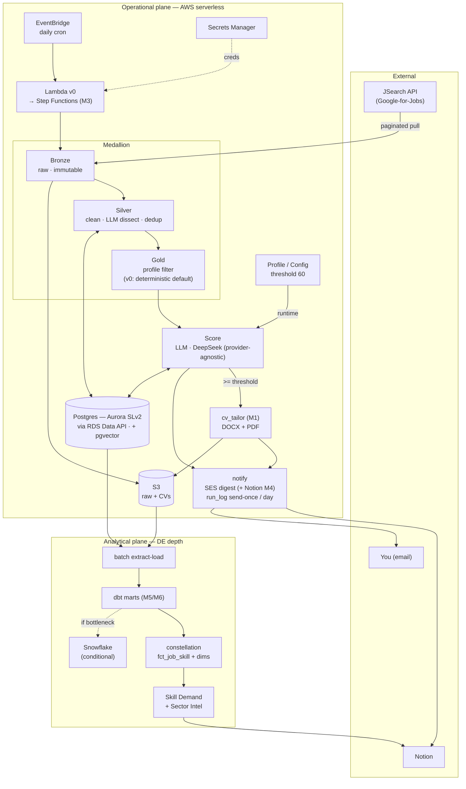
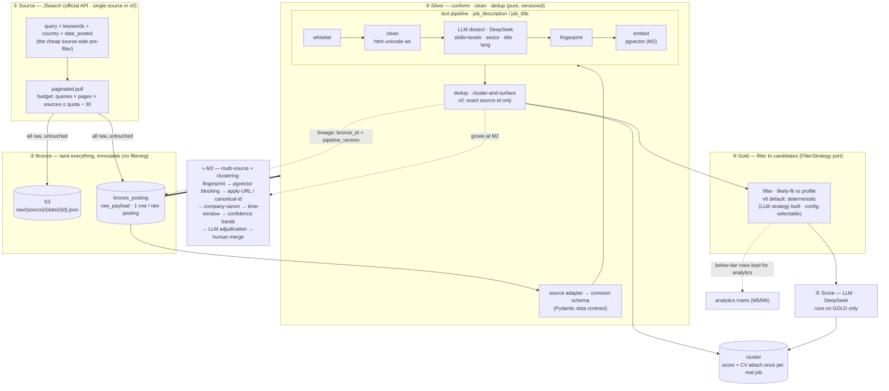
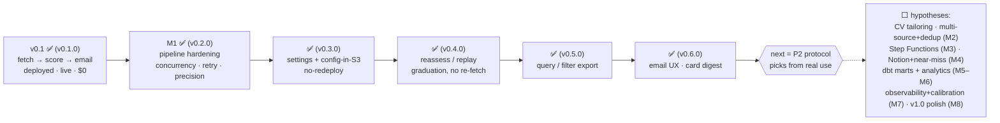
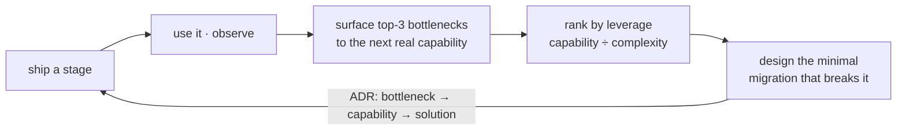
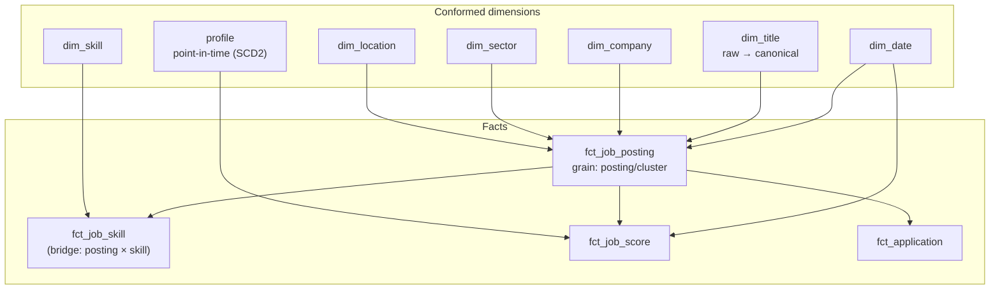

# Diagrams

> The visual index. All repo diagrams are **Mermaid** — they render inline on GitHub and in VS Code's preview, version with the code, and never drift (the text *is* the picture). Edit any block here, or paste it into [mermaid.live](https://mermaid.live) to tweak.
>
> **Convention:** Mermaid is canonical and lives in the repo. [Eraser](https://app.eraser.io) is an optional *personal/portfolio* view (prettier AWS icons, authored via diagram-as-code) — it is **not** committed here to keep the repo text-light. A live link can be shared for the portfolio when wanted.

---

## 1 · Full-stack architecture (target)

The complete two-plane design (high-level). **What's live today is a subset — `v0.6.0`** (one Lambda → fetch → dissect → gold → score → SES card-digest, on Aurora SLv2 via the RDS Data API + S3; **concurrent** dissect/score with a deadline guard; **config read from S3 at runtime**; a **`{"mode":"reassess"}` replay** path; deployed + live-validated); the analytical plane + the other operational boxes arrive by migration. The **ingestion medallion is detailed in §2 below**; the LLM is **provider-agnostic** ([ADR-0012](adr/0012-model-agnostic-llm.md) · [ADR-0017](adr/0017-llm-transport-openai-compatible-deepseek.md)) and v0 runs on **DeepSeek** via the OpenAI-compatible API. Discussed in [02-architecture](02-architecture.md).

---

## 2 · Ingestion — medallion landing (detail)

A zoom-in on the operational plane's first half — **how a day's jobs get from the source API to a scored shortlist**, and why each stage exists. The guarantee is *land-everything-first*: everything downstream is a **pure, replayable function of immutable bronze**. Discussed in [02-architecture · Ingestion](02-architecture.md) · [ADR-0010](adr/0010-job-source-jsearch.md).

**Stage by stage**
- **① Source (JSearch).** The query (`keywords + country + date_posted`) *is* the pre-filter — the API won't pre-filter for us, so the query is how we pay only for plausibly-relevant pages. Cost is bounded by a **request budget**, not storage.
- **② Bronze.** Every raw result is written **untouched** — S3 `raw/…json` + a `bronze_posting` row (`raw_payload`). No filtering, ever: *whatever the API returned today is captured and replayable.*
- **③ Silver.** A source **adapter** normalizes each payload into one common schema (the Pydantic **data contract**). The heavy step is the **LLM `Dissector`** (DeepSeek — [ADR-0016](adr/0016-llm-dissection-at-silver.md)) that extracts `skills[]`+levels, sector, normalized title, language from `job_description`/`job_title`; the rest is field-mapping. Every row carries `bronze_id + pipeline_version` (**origin-level lineage**). Dedup is **cluster-and-surface** — v0 is exact source-id only.
- **④ Gold.** Silver **LLM-dissects every posting** (the market-wide analytics need *all* postings, not just gold); the **gold `FilterStrategy`** then selects the likely-fit subset for scoring. **v0's default is a *deterministic* filter** — at 10–30 jobs/day an LLM gold-filter is redundant with the Scorer (P1); the **LLM strategy is built and config-selectable** behind the same port (a defended deviation from the build plan — see journal §23). Below-bar rows stay in bronze/silver for analytics.
- **⑤ Score.** The **strong DeepSeek model** runs on gold only; score + CV attach to the **cluster** — done once per real job, every platform's apply-link kept.

**Two properties worth discussing**
- **Immutable bronze ⇒ replay.** Change a filter, the threshold, or your profile → re-derive silver→gold→score over existing bronze with **zero new API calls**. **This is live as of `v0.4.0`:** a **`{"mode":"reassess"}`** invocation re-scores the already-scored postings against the *current* profile (no fetch) so a job **graduates** `stretch`→`strong_fit` as your skills grow — `previous_score` tracks the before→after ([ADR-0023](adr/0023-reassess-replay.md)).
- **v0 vs migration.** v0 = single source + exact-id dedup. **M2** grows dedup into full clustering and adds source #2 (the dotted box).

---

## 3 · Roadmap & evolution

The directional roadmap — a **living hypothesis**, not a contract. Live status is the source of truth in [ledgers/phase-index](ledgers/phase-index.md); this is the *shape*. Discussed in [03-roadmap](03-roadmap.md).

**v0 shipped, then a P2-driven capability burst.** v0 (`v0.1.0`, 2026-06-29) deployed + live-validated + torn down to ~$0. Since then the **bottleneck protocol re-ranked the roadmap from real usage** — the pre-drawn M1–M8 was hypothesis, not contract. Shipped so far (all live-validated on the deployed stack): `v0.2.0` **M1 pipeline hardening** (the P2 protocol overruled the pre-drawn *M1 = CV tailoring*), `v0.3.0` **user-customizable settings + runtime config in S3** (change settings via `push_config.py`, no redeploy), `v0.3.1` employment_types enum, `v0.4.0` **reassess/replay** (re-score on an updated profile, no re-fetch — the graduation half of the old M4, early), `v0.5.0` **query/filter access** (export → SQLite/CSV), `v0.6.0` **email UX** (card digest + prominent Apply button). **Next = the bottleneck protocol picks from real use** (the ⬜ below are re-derived hypotheses, not committed).

Each migration is chosen by the **bottleneck-decision protocol**, not the list above:

---

## 4 · Analytical constellation (dimensional model)

How accumulated data compounds into insight: **conformed dimensions** shared across **facts**; insights are *joins* over them. Built at M5/M6, grown per question. Skills + canonical title are **derived from the JD text**. Discussed in [02-architecture](02-architecture.md#analytical-plane--dbt-marts-adr-0004) · [ADR-0011](adr/0011-dimensional-analytical-model.md).

> **Priority order** (Tarig's): `dim_skill` + `fct_job_skill` first (powers skill-demand/gaps *and* sector intel) → point-in-time profile + score facts (progress trends) → `dim_sector`. `dim_title` / `dim_company` are supporting.

---

*The operational data model (ERD) and the operational flow live inline in [02-architecture](02-architecture.md). Add new diagrams here as the design evolves — keep them Mermaid.*
