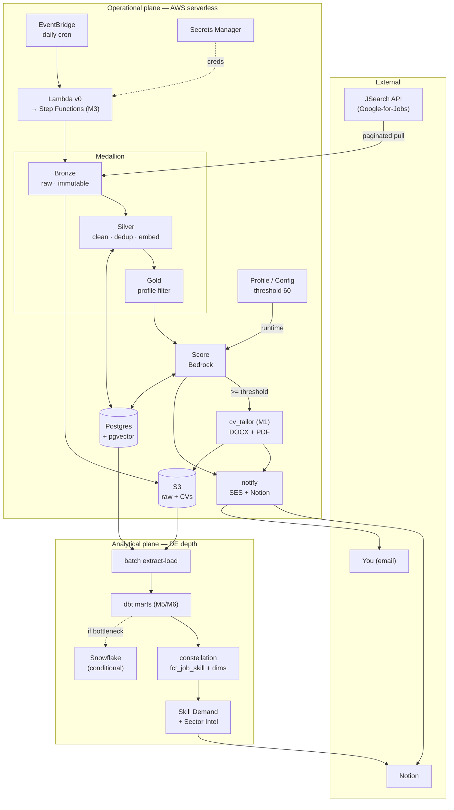
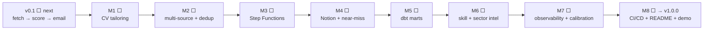
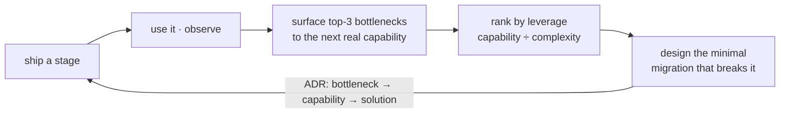
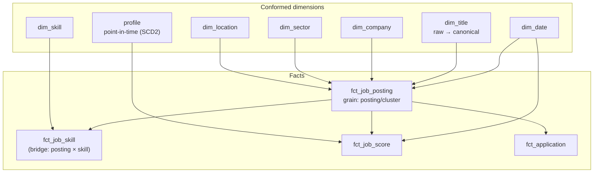

# Diagrams

> The visual index. All repo diagrams are **Mermaid** — they render inline on GitHub and in VS Code's preview, version with the code, and never drift (the text *is* the picture). Edit any block here, or paste it into [mermaid.live](https://mermaid.live) to tweak.
>
> **Convention:** Mermaid is canonical and lives in the repo. [Eraser](https://app.eraser.io) is an optional *personal/portfolio* view (prettier AWS icons, authored via diagram-as-code) — it is **not** committed here to keep the repo text-light. A live link can be shared for the portfolio when wanted.

---

## 1 · Full-stack architecture (target)

The complete two-plane design. **v0 is a small subset** (one Lambda → fetch → score → email); everything else arrives by migration. Discussed in [02-architecture](02-architecture.md).

---

## 2 · Roadmap & evolution

The directional roadmap — a **living hypothesis**, not a contract. Live status is the source of truth in [ledgers/phase-index](ledgers/phase-index.md); this is the *shape*. Discussed in [03-roadmap](03-roadmap.md).

Each migration is chosen by the **bottleneck-decision protocol**, not the list above:

---

## 3 · Analytical constellation (dimensional model)

How accumulated data compounds into insight: **conformed dimensions** shared across **facts**; insights are *joins* over them. Built at M5/M6, grown per question. Skills + canonical title are **derived from the JD text**. Discussed in [02-architecture](02-architecture.md#analytical-plane--dbt-marts-adr-0004) · [ADR-0011](adr/0011-dimensional-analytical-model.md).

> **Priority order** (Tarig's): `dim_skill` + `fct_job_skill` first (powers skill-demand/gaps *and* sector intel) → point-in-time profile + score facts (progress trends) → `dim_sector`. `dim_title` / `dim_company` are supporting.

---

*The operational data model (ERD) and the operational flow live inline in [02-architecture](02-architecture.md). Add new diagrams here as the design evolves — keep them Mermaid.*
